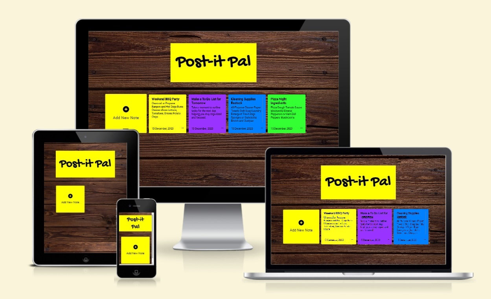

# Post-it Pal

## Introduction

[Post-it Pal](https://cniblock.github.io/sticky-notes/) is a digital note-making web application designed to simplify and organize your notes digitally. It provides users with a user-friendly interface to create, update, and delete notes, making it a convenient tool for personal organization and task management.

## Site Goals

### The primary goals of Post-it Pal

**Efficiency:** Streamline the note-taking process by providing a quick and intuitive platform.

**Organization:** Help users organize their thoughts and tasks in a digital format.

**User-Friendly:** Create a seamless and easy-to-use experience for users of all levels.

## User Goals

**Note Creation:** Easily create new digital notes with titles and descriptions.

**Note Management:** Update or delete existing notes to keep information current.

**Date Stamps:** Manage your notes with Date stamps when notes are created or edited.

## Features of the Site

- **Add and Update Notes**

  - Quickly add new notes with titles and descriptions.
  - Update existing notes with ease.

- **Colored Notes**

  - Different colored notes for visual clarity and an enhanced user experience.

- **User-Friendly Interface**

  - Intuitive design for a smooth user experience.

- **Note Deletion**

  - Easily delete notes that are no longer needed.

- **Date Stamp**

  - Every note entry includes a timestamp to track when the note was created or last updated.

- **Responsive Design**

  - The web application is designed to be accessible on various devices for convenience.

## Testing

### Validator Testing

- **HTML**

  - I can confirm that all HTML on each page has passed without error in the official [W3C Validator](https://validator.w3.org/#validate_by_input).

- **CSS**

  - I can confirm that all CSS has passed without error in the official Jigsaw [Validator](https://jigsaw.w3.org/css-validator/#validate_by_input).

- **JavaScript**
  - I can confirm that all JavaScript has passed without error in [JShint](https://jshint.com/) - there are, however, 13 warnings.

### Accessibility

A disappointing accessibility score, this is due to the bold colors of the note boxes.

## Unfixed Bugs

The only bug I have managed to find is when a note is large and a slider is shown - the edit function is unavailable.

## Deployment

The website has been deployed for several days, and it has been very helpful in testing the website on numerous devices.

The process I followed for deploying the website is as follows:

- From my GitHub project, I went to **Settings**,
- Then selected **Pages** on the left-hand menu,
- Under **Source**, I selected Deploy from a branch,
- Finally, under **branch**, I set it to **main - root** and saved.
- The live website can be found here: <https://cniblock.github.io/sticky-notes/>

## Credits

All HTML and CSS codes were written with knowledge gained from CodeInstitute.

- The majority of JavaScript credit goes to what was learned with CodeInstitute.
- References from the textbook **JavaScript & jQuery - by Jon Duckett** were used for the LocalStorage solutions.
- [YouTube tutorials](https://www.youtube.com/watch?v=Efo7nIUF2JY) also assisted in LocalStorage options and generating colored Notes.

## Additional Comments

A few points I didn't manage to achieve my desired outcome are:

- I would have liked the notes to have been added at the end of all previous notes, not after the "add Note box" and before the last note.
- Ideally, the colors of the newly added notes would have been random; currently, the colors are in a set order.
- More time could have been spent styling the page; although I think it looks okay, it could be improved.
- The style on the popupBox is very simple and would have been improved if I had given myself more time.
- Perhaps adding a timestamp to the date section would have been an option, but I was concerned about the lack of space on the note.
